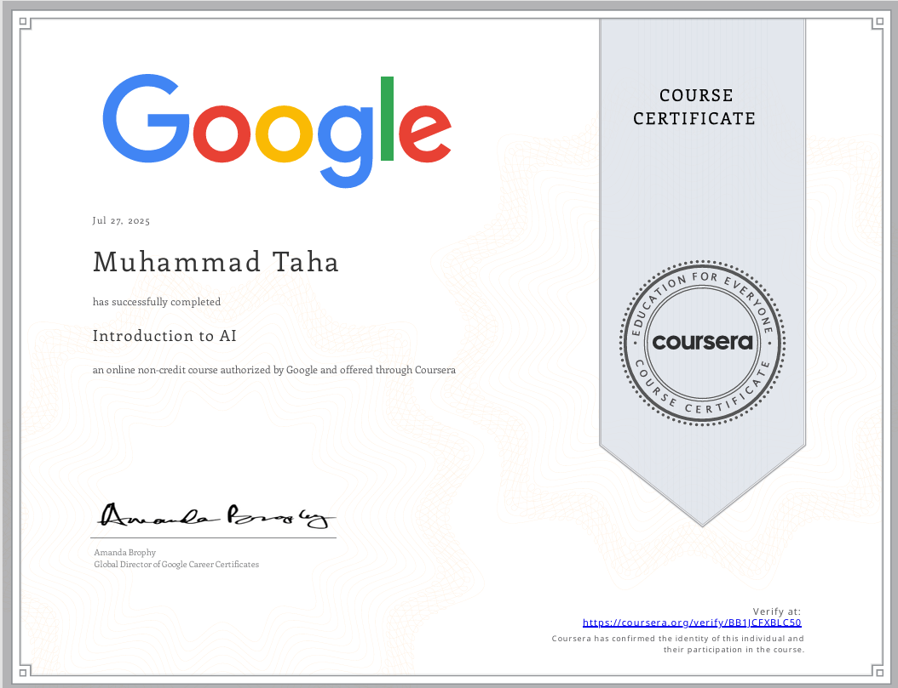
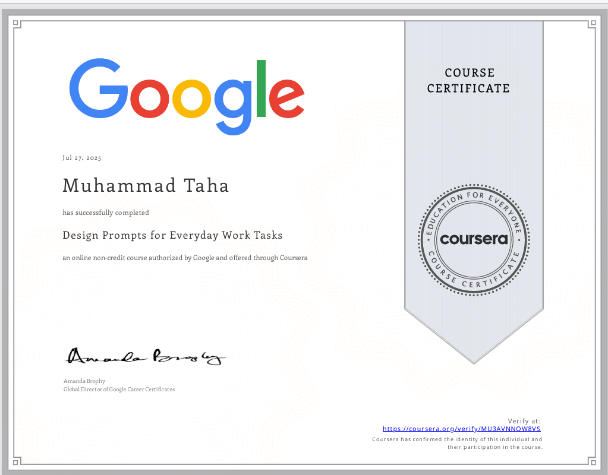

    

  

## 📫 Connect with Me

## 📚 Programming Languages

# 📊 GitHub Stats:

img src="https://github-readme-streak-stats-eight.vercel.app/?user=Taha-Shaikh7&theme=tokyonight&hide_border=true&sideNums=e8df7a&fire=e8df7a&dates=e8df7a"> 
     
     
    

## 📈 Contribution Activity

<!-- Snake Game Repo View -->

  

## 🏅 Certificates & Achievements

 

 

## 🏆 GitHub Trophies

## ✍️ Random Dev Quote

