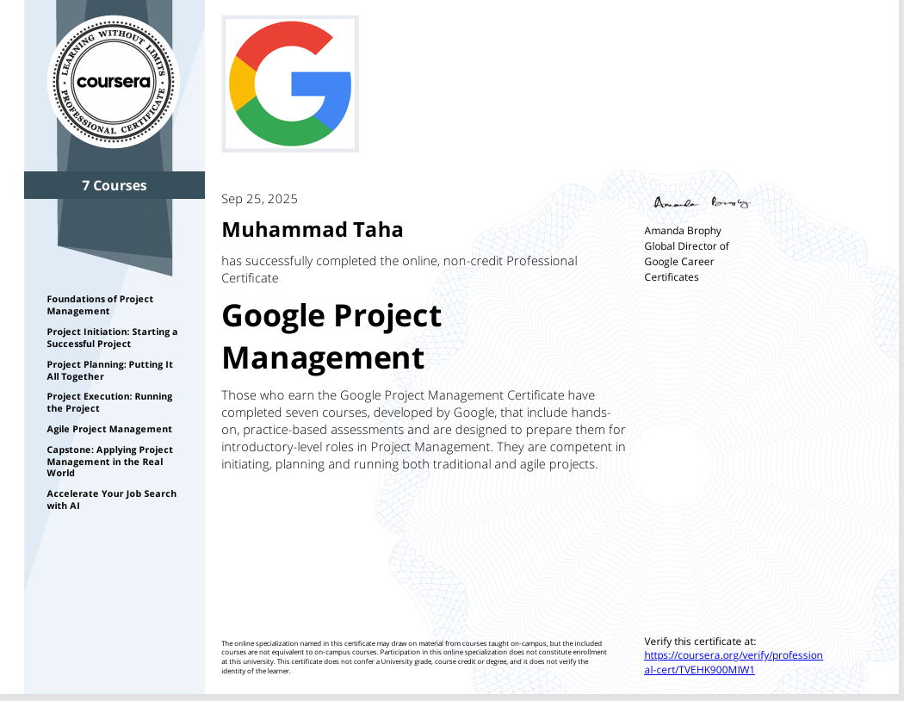
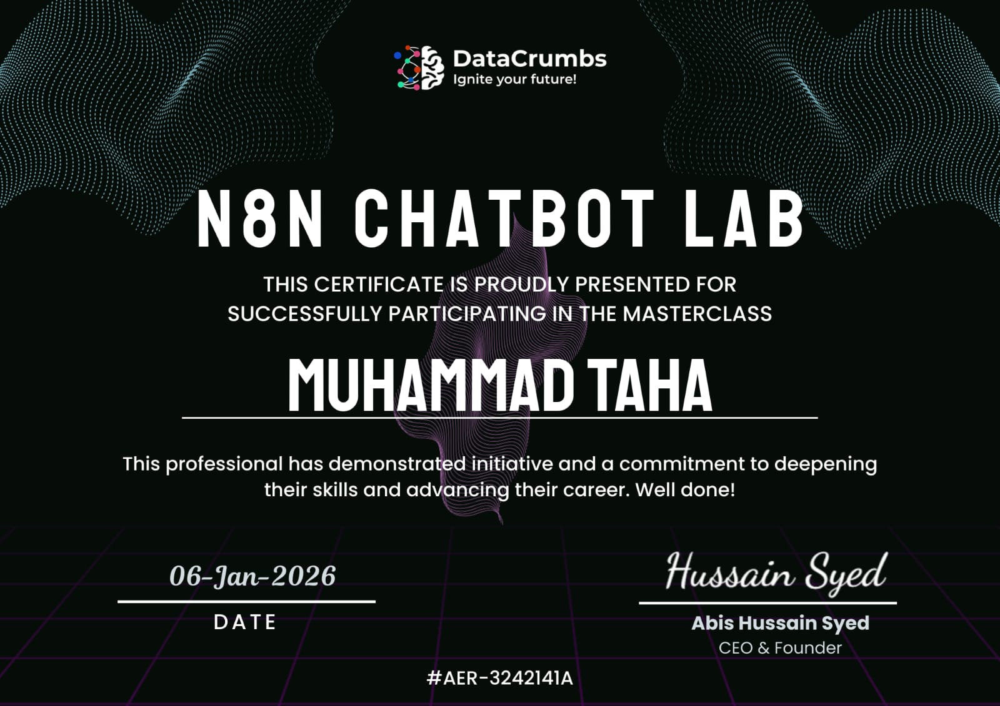
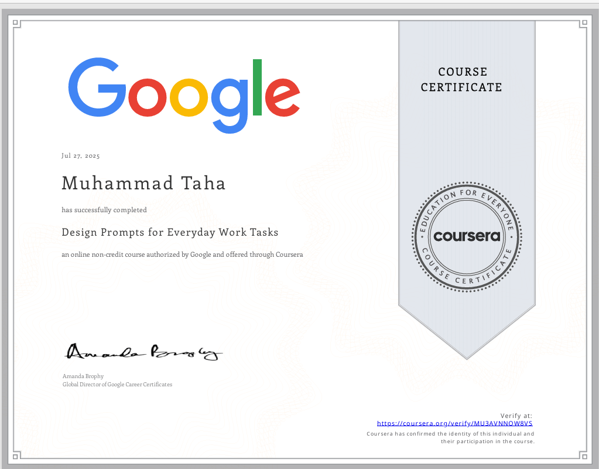

## 📫 Connect with Me

  

  

  

    

## 📚 Programming Languages

<!--<h2 style="color:#7AA2F7; display: flex; align-items: center;">
    
        LeetCode Stats:
        
</h2>

    

 -->

## 📊 GitHub Stats:

   

  

   

  

  

   

  

## 📈 Contribution Activity

<!-- Snake Game Repo View -->

  

## 🏅 Certificates & Achievements

    
    
    
     
    
    
    
     
    
    
    

## ✍️ Random Dev Quote

